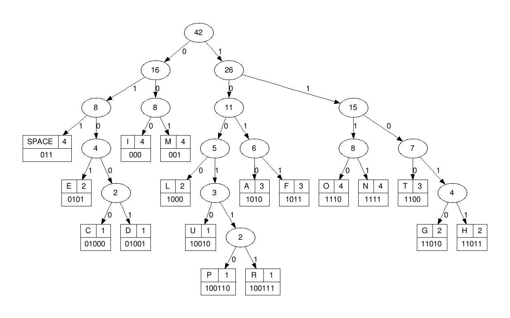
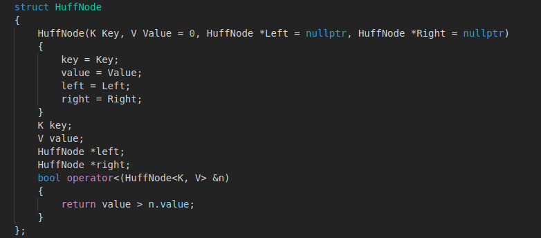
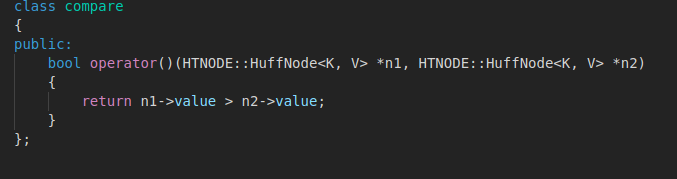
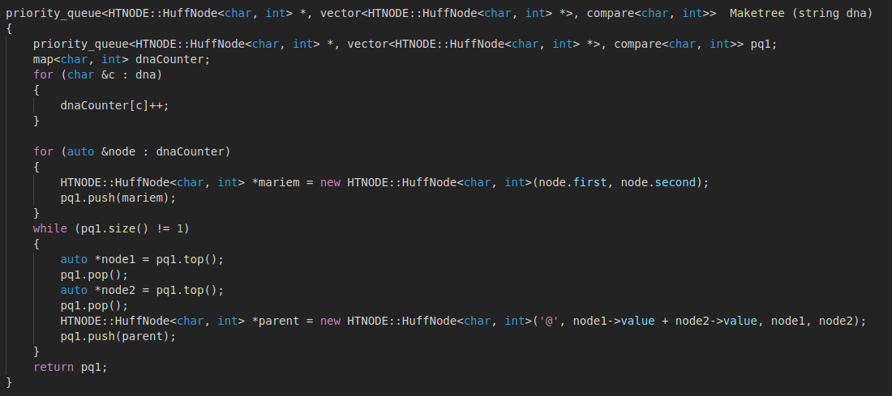
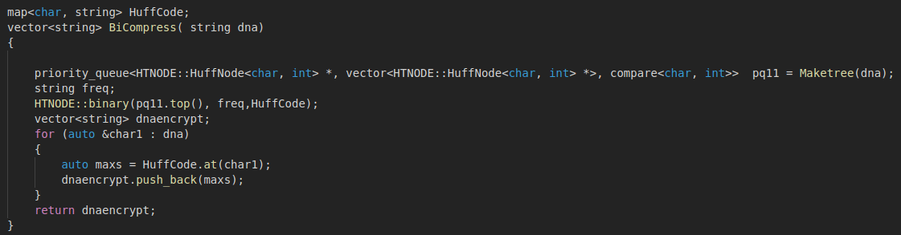
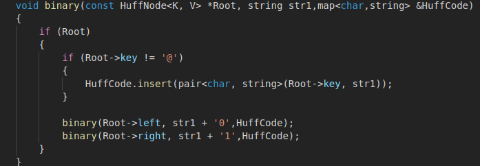
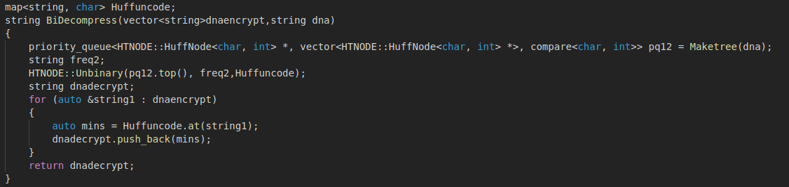
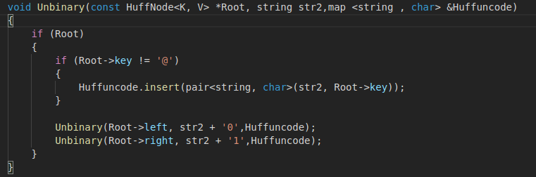
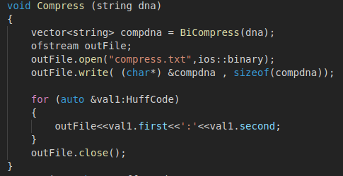
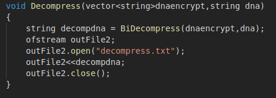

# Huffman Algorithm
#### This repository demonstartes a simple explanation to the huffman algorithm and it's implentation from scratch using C++
---
Huffman algorithm is a method used to compress text files, using abstract data types like heap and map.
In this method we aim to store the text or the information in the fewest bits,instead of storing each symbol in 8 bites we will represent each symbol by a binary number.  
**ex:** 

 A | B | c
---|---|---
0 | 01| 11

The algorithm depends on how many times each symbol appears in the text, the symbol that appears more in the text, its binary representaton will be shorter than symbol that appears rarely in the text.  
## steps of the process
1. The algorithm counts how many times did each element appear in the text and store those values in priority queue(minimum).
2. Then take the first two elements(children) in the queue and push their summation in a MAP(parent) , which takes a **value=the summation** and a **key=character** (in our code we use '@' for the parents).
3. After that we push the two children in the MAP ,and push again the parent in the queue.
4. We repeat those steps until the queue is empty and all elements get pushed in the map , each symbol in the MAP will be leaf .
5. So, now each leaf in the MAP has a value and a key but how to print the binary representation of each symbol ? each left child in the MAP will have a binary number = "0" ,and every right child will have a binary number ="1", using this way we can get every binary representation for each symbol.

  **Now we are going to describe each part of the algorithm**
### Huffman Node
We create a struct named Huffnode which is the node of the map and has 4 members: 
* Key : the key of the node 
* value : the value of the node
* Left child
* Right child
we also implement a constructor for initialization, and an operator which returns the value of the node.

### class compare
* This class only has an operator which compares between values of two huffnodes and returns true  
if they are equal and false if they aren't.

### Maketree
 This functions takes a string input and returns a priority queue .
* first we declare minimum heap called pq1,and a map of characters called dnacounter.
* then we count the number of symboles of the input.
* for each symbole we create a huffnode and push it in the heap.
* we take the first two elements of the heap and make a new node which has a value = summation of those two node", "key= @ " and its child are the original two nodes.
* then we push this new again in the heap,we repeat this process until the heap has only one child.

### BiCompress function
This function creates a minimum heap(priority queue) and an empty map wich will be sent to the binary function, then the binary function will complete the map and resends it to the bicompress function. Then the bicompress function will replace each string by its corresponding binary value , finally it'll send it to the compress function.

### Binary function
This function takes three inputs:
* HuffNode
* Map
* string(key)  
and inserts a node in the map using the input string as a key, and it has three cases:
1.  if the node is a parent which has a default string symbol " @ " , the we insert it without any change 
2. if the node is left child, we'll add '0' to string
3. if the node is right child, we'll add '1' to string

### BiDecompress function
This function will receive the map from the unbinary function and it'll replace each binary value by its corresponding string then it'll sen it to the decompress function.

### Unbinary function
This function is the opposite of the binary function,the key of the map is from type char instead of string in the binary function.

### Compress function
This function makes the compression process,it takes the map from the bicompress function and makes a file for it.

### Decompress function
* This function is the opposite of the compress function , instead of taking a text and convert it to a binary representation it takes a binary file and convert it to a text.

